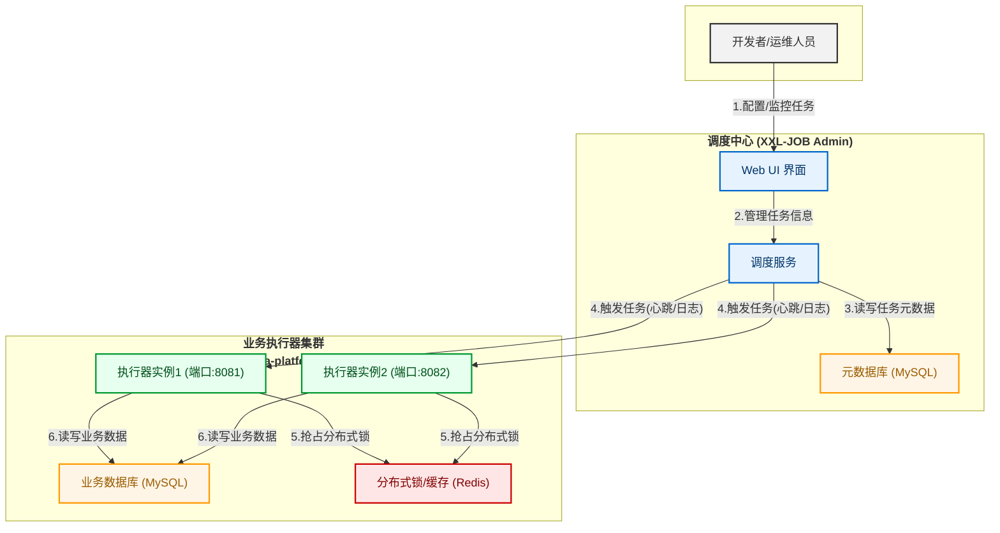

# 企业级分布式数据处理与对账平台

     

## 1. 项目简介

本项目是一个专为**高可靠、高性能**的企业级业务场景而设计的**分布式数据处理与对账平台**。它完整地模拟了企业（特别是金融、电商领域）核心的后端数据流转与处理过程，涵盖了从**自动化任务调度、数据处理、性能优化**到**分布式并发控制**的全链路技术实践。

该平台的核心架构，是一个由 **XXL-JOB** 驱动的**离线批处理系统**，负责处理海量数据的对账、报表等核心业务，同时具备向“**批流一体**”混合架构演进的能力。

---

## 2. 系统架构图

---

## 3. 核心功能与技术亮点

#### ✨ 高可靠的自动化任务调度
* 基于 **XXL-JOB** 搭建了企业级的分布式任务调度平台，对所有后端批处理任务进行统一的生命周期管理。
* 深入实践了 **失败重试**、**故障转移** 路由策略和 **邮件告警** 机制，确保了核心业务任务在异常情况下的高可靠性。

#### ✨ 数据库性能优化实战
* 针对百万级海量数据的查询场景，通过 **MySQL `EXPLAIN`** 命令精准分析出“全表扫描”的性能瓶颈。
* 通过设计并添加**B+树索引**，成功将目标SQL的查询耗时从 **900+毫秒** 优化至 **3毫秒**，性能提升**超过300倍**，深刻理解了索引在性能调优中的关键作用。

#### ✨ 分布式并发控制
* 针对执行器集群环境下任务可能被重复执行的问题，基于 **Redis** 的 `SETNX` 原子命令，设计并实现了一套**分布式锁**。
* 成功验证了该锁机制能够保证核心业务（如数据对账）在分布式环境下的**幂等性**与**数据一致性**。

#### ✨ 复杂的自动化工作流编排 (DAG)
* 利用 XXL-JOB 的**子任务**特性，实现了“先执行数据对账、成功后再执行报表生成”的自动化**任务依赖**关系，保证了业务流程的严格顺序性。

#### ✨ 海量数据并行处理方案
* 通过在本机模拟**执行器集群**，并采用“**分片广播**”路由策略，成功实现了将单一的海量数据任务“切分”给多个节点**并行处理**的方案，为系统的水平扩展和性能提升打下了基础。

---

## 4. 技术栈

| 技术领域 | 具体技术 |
| :--- | :--- |
| **后端主框架** | Spring Boot 2.7.18 |
| **分布式任务调度** | XXL-JOB 2.4.1 |
| **数据库** | MySQL 8.0 |
| **持久层框架** | MyBatis-Plus |
| **缓存/分布式锁** | Redis |
| **消息队列** | **RabbitMQ** *(后续规划)* |
| **项目构建** | Maven 3.9+ |
| **架构/部署** | **Docker, Docker Compose** *(后续规划)* |
| **开发环境** | IntelliJ IDEA, JDK 17/21 |

---

## 5. 快速开始

#### **5.1 准备依赖环境**
- 安装并启动 MySQL 8.0+
- 安装并启动 Redis

#### **5.2 部署 XXL-JOB 调度中心**
- 从 XXL-JOB 官方 [Gitee Releases](https://gitee.com/xuxueli/xxl-job/releases) 页面下载 `xxl-job-2.4.1.zip` 源码。
- 在 MySQL 中创建 `xxl_job` 数据库，并执行源码包中的 `doc/db/tables_xxl_job.sql` 脚本。
- 修改 `xxl-job-admin` 模块下的 `application.properties` 文件，配置好数据库连接。
- 运行 `XxlJobAdminApplication`，启动调度中心（默认端口 `8080`）。

#### **5.3 部署本项目 (data-platform)**
- 克隆本项目到本地: `git clone https://github.com/sssshine24/data-processing-platform.git`
- 将 `src/main/resources/application.properties.example` 复制一份，重命名为 `application.properties`。
- 在新的 `application.properties` 文件中，填入你自己的数据库、Redis 和 XXL-JOB `accessToken` 配置。
- 在 IntelliJ IDEA 中运行 `DataPlatformApplication`，启动本项目执行器（默认端口 `8081`）。

---

## 6. 后续规划 (TODO)

- [ ] **构建高并发实时数据接收端**
  - **目标**：为平台增加处理实时数据流的能力，构建“批流一体”的混合架构。
  - **实现路径**：
    - 引入 **RabbitMQ 消息队列**，将数据入口改造为**异步架构**，实现服务间的深度解耦和流量的**削峰填谷**。
    - 开发一个面向外部的、基于 Spring MVC 的**高并发 API 接口**，用于接收实时数据。
    - 编写独立的**消息消费者**，从队列中安全地获取数据并持久化到数据库。

- [ ] **容器化与一键部署**
  - **目标**：提升项目的部署效率和环境一致性，向 DevOps 迈进。
  - **实现路径**：
    - 为 `data-platform` 执行器、`xxl-job-admin` 调度中心、`MySQL`、`Redis` 等所有组件，分别编写 **Dockerfile**。
    - 使用 **Docker Compose** 编写统一的编排脚本，实现整个项目环境的“**一键启动**”和“一键销毁”。
